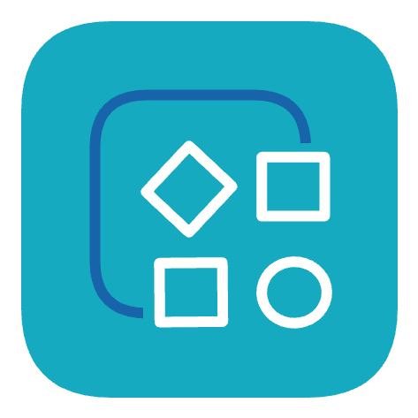
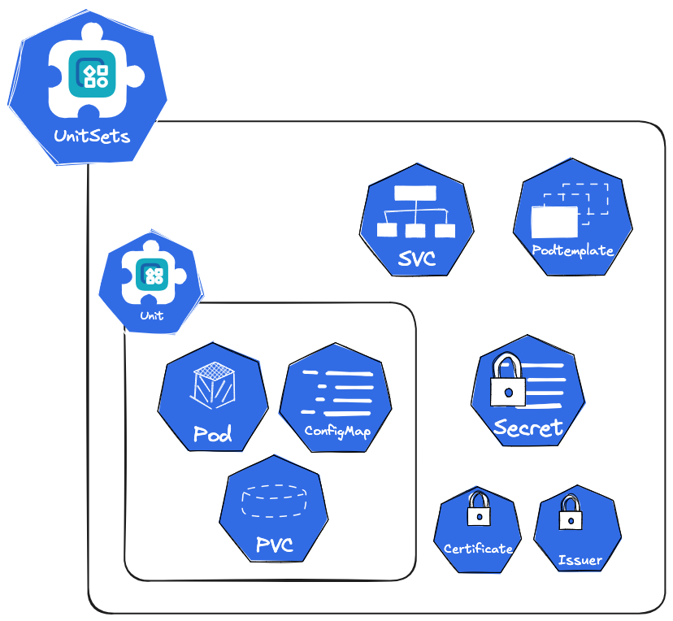

# Unit Operator

[](https://goreportcard.com/report/github.com/upmio/unit-operator)
[](https://github.com/upmio/unit-operator/blob/main/LICENSE)
[](https://github.com/upmio/unit-operator/releases)
[](https://github.com/upmio/unit-operator)



A Kubernetes-based extension suite focused on extending pod management capabilities such as deployment, publishing, operations, and availability protection.

## ✨ Features

- 🎯 **UnitSet Management**: Manages sets of distributed units with shared configuration
- 📦 **Unit Lifecycle**: Individual workload instance management with sidecar agents
- 📞 **gRPC Operations**: Manages gRPC-based operations between units
- 🛡️ **High Availability**: Built-in replication and failover mechanisms
- 📈 **Scaling**: Horizontal and vertical scaling capabilities
- 🔄 **Lifecycle Management**: Automated backup, recovery, and upgrades
- ⚙️ **Configuration Management**: Template-based configuration with shared configs
- 📊 **Monitoring**: Integrated metrics and health checks
- 🔐 **Security**: Certificate management and secure credential handling
- 🧩 **Compose Operator Integration**: Optional integration with [Compose Operator](https://github.com/upmio/compose-operator) for database replication/topologies (MySQL, Redis, PostgreSQL, ProxySQL)

## 🏗️ Architecture

The Unit Operator follows a two-layer architecture:

```text
┌─────────────────────────────────────┐
│           UnitSet                   │
│      (Cluster Manager)              │
├─────────────────────────────────────┤
│  ┌─────────────┐  ┌─────────────┐   │
│  │   Unit-0    │  │   Unit-1    │   │
│  │ (Pod+Agent) │  │ (Pod+Agent) │   │
│  └─────────────┘  └─────────────┘   │
│                                     │
│  ┌─────────────┐  ┌─────────────┐   │
│  │   Unit-2    │  │    ...      │   │
│  │ (Pod+Agent) │  │             │   │
│  └─────────────┘  └─────────────┘   │
└─────────────────────────────────────┘
```

- 🎯 **UnitSet**: Manages a set of distributed units with shared configuration
- 📦 **Unit**: Individual workload instances with sidecar agents for advanced operations
- 📞 **GrpcCall**: Manages gRPC-based operations between units
- 🤖 **Agent**: Sidecar container providing unit-specific operations and configuration management



## 🚀 Install

### Prerequisites

- Kubernetes ≥ 1.29 or OpenShift ≥ 4.14
- `helm` v3 installed and available
- Permissions to create CRDs, RBAC, and ServiceAccounts in the target namespace

### Overview

By default, the Unit Operator is installed into the `upm-system` namespace.

For Custom Resource Definitions (CRDs), you can install them manually (recommended for production) or enable installation via this chart:

- Install CRDs manually: uninstalling the chart will not affect the CRDs and their CR instances
- Install CRDs via this chart (`crds.enabled=true`): uninstalling the chart will also remove the CRDs and thus delete all related CRs; use with care

> To find more details, click on the following document:
>
> [Unit Operator Helm Chart](./charts/unit-operator/README.md)

## ⚙️ Configuration

### 🎯 Supported Resource Types

| Resource | 📊 API Version | 📝 Description |
|-----------|-------------|-------------------|
| UnitSet | v1alpha2 | Manages a set of distributed units |
| Unit | v1alpha2 | Individual workload instances |
| GrpcCall | v1alpha1 | Manages gRPC-based operations |
| Project | v1alpha2 | Manages project-level configuration and resources |

### 📞 gRPC Communication

The operator supports gRPC communication between units:

- Service discovery and registration
- Configuration synchronization
- Cross-unit communication

## 💻 Development

### 🛠️ Setup Development Environment

```bash
# Clone the repository
git clone https://github.com/upmio/unit-operator.git
cd unit-operator

# Install dependencies
go mod download

# Install required tools
make kustomize controller-gen envtest
# Optional (recommended for packaging/linting)
make operator-sdk golangci-lint
```

### 🏗️ Build and Run

```bash
# Build the operator
make build

# Run locally
make run

# Run tests
make test

# Run with coverage
make check-coverage
```

### 🔧 Code Generation

```bash
# Generate CRDs and manifests
make manifests

# Generate deepcopy methods
make generate

# Generate protobuf code
make pb-gen
```

## 📚 API Reference

The Unit Operator provides the following custom resources:

- 🎯 [UnitSet](doc/unit-operator_api.md#unitset): Manages a cluster of workload instances
- 📦 [Unit](doc/unit-operator_api.md#unit): Individual workload instance
- 📞 [GrpcCall](doc/unit-operator_api.md#grpccall): gRPC-based operations
- 🏗️ [Project](doc/unit-operator_api.md#project): Manages project-level configuration and resources

### 🧩 Compose Operator Integration (optional)

Unit Operator orchestrates workloads around `UnitSet/Unit` (Pods, PVCs, Services, rolling upgrades, agent coordination). If you need database replication/topologies, install and use [Compose Operator](https://github.com/upmio/compose-operator) alongside.

- Use `UnitSet` for distributed layout, shared configuration, and lifecycle
- Use Compose Operator CRDs for database replication/cluster topologies, for example:
  - MysqlReplication: MySQL async/semi-sync/Group Replication
  - PostgresReplication: PostgreSQL streaming replication
  - RedisReplication / RedisCluster: Redis replication/cluster
  - ProxySQLSync: ProxySQL administration and synchronization
- Use `GrpcCall` for agent-driven operational tasks across units

Note: Unit Operator works independently; install Compose Operator only if you need these replication capabilities.

### 🔐 Compose Operator password encryption example (optional)

When using Compose Operator database CRDs, credentials must be AES-256-CTR encrypted and stored in Secrets. Example workflow below (commands from the Compose Operator docs; build the tool in its repository):

```bash
# Build the encryption tool in the compose-operator repository
go build -o aes-tool ./tool/

# Get the AES key generated by compose-operator (replace namespace/release accordingly)
AES_KEY=$(kubectl get secret compose-operator-aes-secret -n upm-system -o jsonpath='{.data.AES_SECRET_KEY}' | base64 -d)

# MySQL example
aes-tool -key "$AES_KEY" -plaintext "mysql_root_password" -username "mysql"
aes-tool -key "$AES_KEY" -plaintext "replication_password" -username "replication"
kubectl create secret generic mysql-credentials \
  --from-file=mysql=mysql.bin \
  --from-file=replication=replication.bin

# Redis example
aes-tool -key "$AES_KEY" -plaintext "redis_auth_password" -username "redis"
kubectl create secret generic redis-credentials \
  --from-file=redis=redis.bin

# PostgreSQL example
aes-tool -key "$AES_KEY" -plaintext "postgresql_admin_password" -username "postgresql"
aes-tool -key "$AES_KEY" -plaintext "replication_password" -username "replication"
kubectl create secret generic postgres-credentials \
  --from-file=postgresql=postgresql.bin \
  --from-file=replication=replication.bin

# ProxySQL example
aes-tool -key "$AES_KEY" -plaintext "proxysql_admin_password" -username "proxysql"
aes-tool -key "$AES_KEY" -plaintext "mysql_backend_password" -username "mysql"
kubectl create secret generic proxysql-credentials \
  --from-file=proxysql=proxysql.bin \
  --from-file=mysql=mysql.bin
```

> Note: The capabilities and tooling above come from the Compose Operator project. Refer to its latest documentation: `https://github.com/upmio/compose-operator`.

## 🚨 Troubleshooting

### ⚠️ Common Issues

1. **Pods stuck in Pending state**
   - Check resource requests/limits
   - Verify storage class availability
   - Ensure sufficient cluster resources

2. **Replication not working**
   - Verify network connectivity between pods
   - Check credential secrets
   - Review replication configuration

3. **Upgrade failures**
   - Check operator logs for errors
   - Verify upgrade strategy configuration
   - Ensure sufficient disk space

### 🔍 Debug Commands

```bash
# Check operator logs
kubectl logs -n upm-system deployment/unit-operator

# Check UnitSet events
kubectl describe unitset <name>

# Check individual Unit status
kubectl describe unit <name>

# Check agent logs
kubectl logs <pod-name> -c agent
```

## 🤝 Contributing

We welcome contributions! Please see our [CONTRIBUTING.md](CONTRIBUTING.md) for details.

### 🔄 Development Workflow

1. Fork the repository
2. Create a feature branch
3. Make your changes
4. Add tests for new functionality
5. Run linting and tests
6. Submit a pull request

### 🎨 Code Style

- Follow Go standard formatting
- Use `make fmt` and `make vet` before committing
- Ensure tests pass with `make test`
- Maintain test coverage above threshold

## 📄 License

This project is licensed under the Apache License 2.0 - see the [LICENSE](LICENSE) file for details.

## 🆘 Support

- 📚 [Documentation](doc/unit-operator_api.md)
- 🐛 [Issues](https://github.com/upmio/unit-operator/issues)

## 🙏 Acknowledgments


Built with ❤️ using these amazing tools and frameworks

- 🏗️ [Kubebuilder](https://book.kubebuilder.io/) - Kubernetes API development framework
- 🎛️ [controller-runtime](https://github.com/kubernetes-sigs/controller-runtime) - Kubernetes controller framework

---


Made with ❤️ by the Unit Operator community
